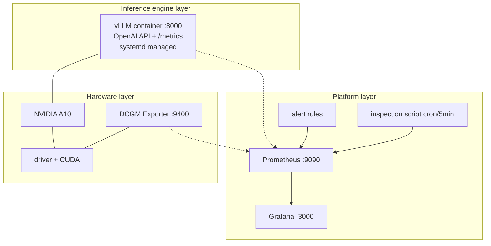

# Architecture

Single AlmaLinux 10 node, one NVIDIA A10. Three layers.

## Roles

Each role is independent. site.yml runs them in order.

    preflight    read-only environment checks before any change
    nvidia       install driver from the CUDA repo, verify nvidia-smi
    docker       docker-ce + nvidia-container-toolkit + runtime config
    vllm         vllm container, systemd unit, model mount
    monitoring   dcgm-exporter, prometheus, grafana, alert rules
    inspect      node health check script + cron

## Data flow

    vLLM /metrics          :8000  ->  Prometheus  ->  Grafana
    DCGM Exporter          :9400  ->  Prometheus  ->  Grafana
    inspect textfile       (disk) ->  node_exporter ->  Prometheus

The inspection script writes Prometheus textfile metrics to
/var/lib/node_exporter/textfile_collector/. node_exporter exposes them
over HTTP. Prometheus scrapes node_exporter like any other target.

## Why no Kubernetes

Single GPU node, one service, one operator. K8s would add a control
plane, an ingress, a storage class, and a CRD for no benefit. systemd
plus Docker does the same job in 200 lines of Ansible.

## Why model weights are mounted, not baked

The vLLM image is public and stable. The model changes. Keeping weights
on the host under data/hf-cache/models/ means:

- switching models is a one-line change, no image rebuild
- the same image serves different models on different hosts
- model download can fail or retry without touching the container
